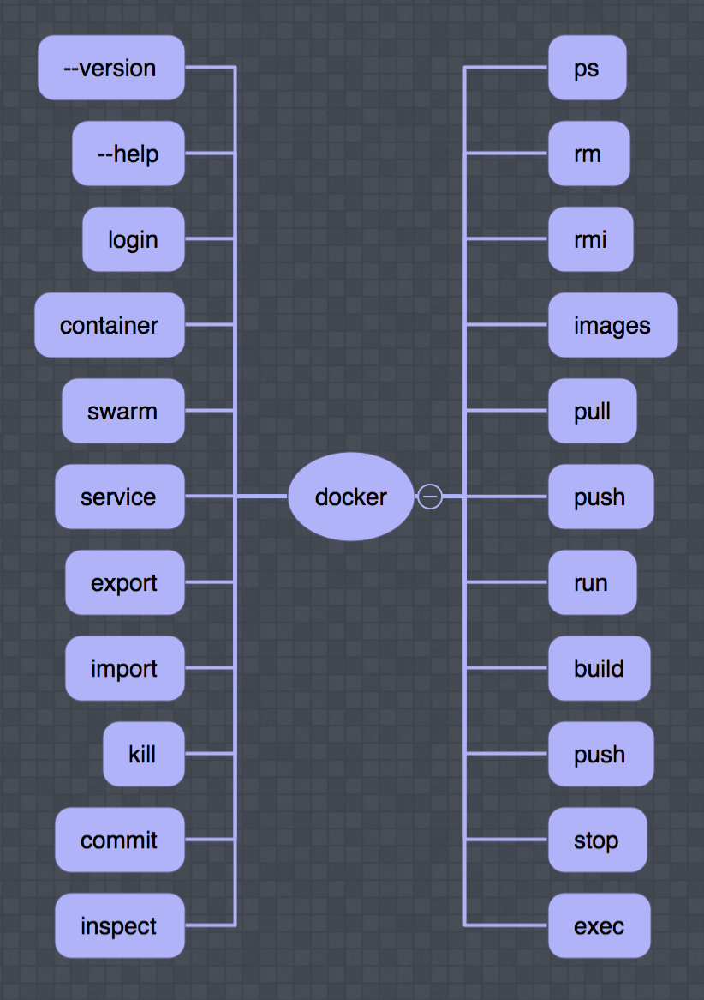

<!-- .slide: data-background="orange" -->
# Docker

---
# Who

Ivo Woltring  
Codesmith   
@  
Ordina JTech    

---

# ?

---
# Whaaat???

---

> It works on my machine!

Note:
- Consistency of env during lifecycle app

---
# Flow

Note:
Dockerfile > image > registry > container(s)

or

Dockerfile > Git repo > CI / CD > building > testing > staging > production

---

---

Note:
- ENTRYPOINT default `/bin/sh -c`
- CMD No default
- ADD also urls
- COPY basic copy (prefered)
- MAINTAINER (deprecated use label)

---

---

---

# Security

Note:
- base image
- Root
- do you trust the creator?

---
# ?
--- 
<!-- .slide: data-background="orange" -->

https://www.ivonet.nl   
Twitter: @ivonet  

---
# GitHub

https://github.com/IvoNet/docker-course

or

http://ivo2u.nl/YX
