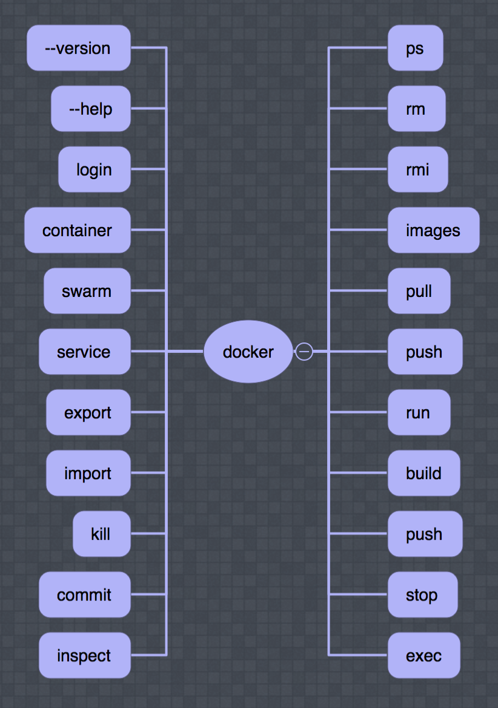
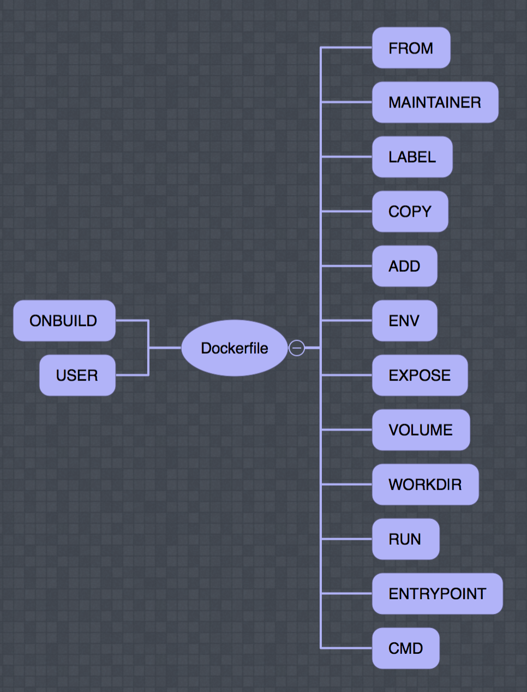

<!-- .slide: data-background="orange" -->
# Docker


---
# Who

Ivo Woltring  
Codesmith   
@  
Ordina JTech    

---

# ?

---
# Whaaat???

---
# Why?

Note:
- Maintenance
- Modular build
- Free technology choice (language / tools / os)
- bugs isolated

---

> It works on my machine!

Note:
- Consistency of env during lifecycle app

---

Virtual Machine

vs

Docker

Note:
- Virtual machines waste resources
- Docker containers are kinda lightweight vm

---
# Image

---
# Container


Note:
- Runtime version of the image (Session)
---

# Registry / hub

Note:
- Show hub.docker.com

---
# Flow

Note:
Dockerfile > image > registry > container(s)

or

Dockerfile > Git repo > CI / CD > building > testing > staging > production

---



---

# Dockerfile

```dockerfile
FROM alpine

LABEL maintainer="@IvoNet"

CMD ["echo", "Hello, Wold."]

```
---



Note:
- ENTRYPOINT default `/bin/sh -c`
- CMD No default
- ADD also urls
- COPY basic copy (prefered)
- MAINTAINER (deprecated use label)
---

# docker-compose

---


---

# Security

Note:
- base image
- Root
- do you trust the creator?

---
# ?
--- 
<!-- .slide: data-background="orange" -->

https://www.ivonet.nl   
Twitter: @ivonet  

---
# Resource

* [Best Practices](http://ivo2u.nl/Yv)